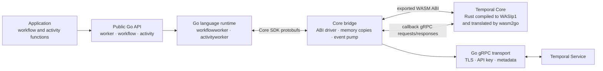
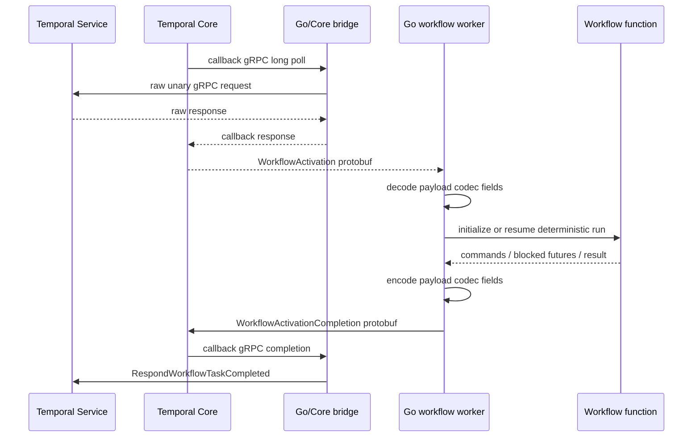
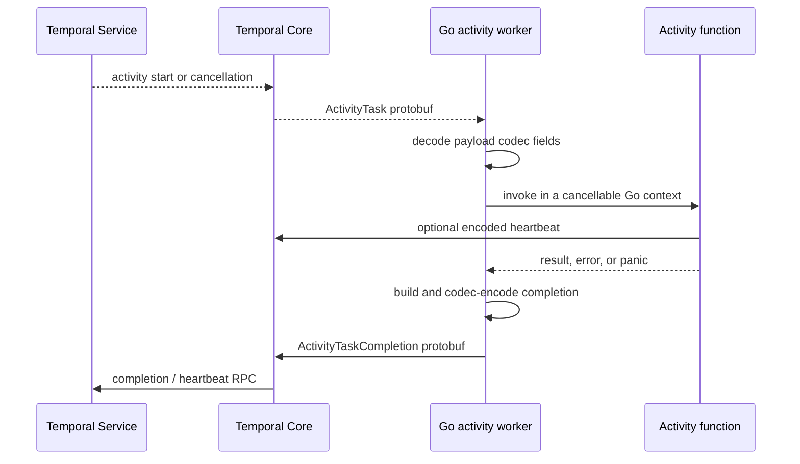

# Architecture

This repository is a prototype Temporal Go SDK worker built on the real Temporal Core. Temporal
Core is compiled from Rust to WASIp1, translated into Go, and embedded in the worker process. The
Go layer supplies the network transport and executes user workflow and activity functions; Core
owns communication with Temporal, task polling, workflow-history processing, retries, heartbeats,
cancellation, eager activity dispatch, and shutdown coordination.

## System overview

There are three important boundaries:

1. The supported library surface consists only of [`activity`](../activity),
   [`workflow`](../workflow), and [`worker`](../worker). Everything under [`internal`](../internal)
   is an implementation detail.
2. Go language workers and Core exchange serialized Core SDK protobuf messages for workflow
   activations, workflow completions, activity tasks, activity completions, and heartbeats.
3. Core cannot open sockets inside this WASM embedding. It emits raw unary gRPC requests through a
   callback transport; the Go host performs those calls and returns the raw responses.

## Responsibility split

| Layer | Owns | Does not own |
| --- | --- | --- |
| Application | Workflow and activity implementations, registration, worker lifetime | Polling or history interpretation |
| Public Go API | Typed futures, supported workflow commands, worker configuration and registration | Temporal service transport details |
| Go language runtime | Function invocation, payload conversion, deterministic coroutine dispatch, run cache, activity goroutines, completion pipelines | Server-side retry policy or history state machines |
| Go/Core bridge | Guest memory, ABI serialization, Core event-loop driving, concurrent gRPC forwarding, bridge shutdown | Workflow business logic |
| Temporal Core | Worker pollers and slots, history/replay processing, command state machines, eager activities, retries, cancellation, heartbeats | Calling Go user functions or opening the final network connection |
| Go gRPC host | Connections, TLS, bearer authentication, deadlines, request/response metadata | Decoding Temporal API request bodies |

## Repository map

| Path | Purpose |
| --- | --- |
| [`activity/`](../activity) | Public activity-side API. Currently exposes heartbeat recording. |
| [`workflow/`](../workflow) | Public deterministic workflow API, typed futures, timers, activities, child workflows, signal channels, and workflow goroutines. |
| [`worker/`](../worker) | Public combined-worker construction, registration, configuration, run, and shutdown. |
| [`internal/workflowworker/`](../internal/workflowworker) | Go workflow interpreter, per-run cache, deterministic dispatcher, and workflow activation loop. |
| [`internal/activityworker/`](../internal/activityworker) | Activity invocation, cancellation, heartbeat handling, and activity task loop. |
| [`internal/corebridge/`](../internal/corebridge) | Host-side driver for the generated Core module and callback gRPC event pump. |
| [`internal/wasmhost/`](../internal/wasmhost) | Minimal WASI imports and the raw Go gRPC client used on Core's behalf. |
| [`internal/corepb/`](../internal/corepb) | Generated Go bindings for the Core SDK and bridge protobuf contracts. |
| [`internal/corewasm/`](../internal/corewasm) | Generated `wasm2go` module. `generated.go` is committed for reproducible downstream Go builds. |
| [`internal/converter/`](../internal/converter) | Go value/payload conversion and recursive payload-codec application. |
| [`internal/invoker/`](../internal/invoker) | Registration signature validation and reflective function invocation. |
| [`internal/completionpipe/`](../internal/completionpipe) | Bounded concurrent submission of workflow and activity completions. |
| [`internal/sdk-core/`](../internal/sdk-core) | `sdk-rust` submodule plus this prototype's Rust WASM bridge crate and shared protobuf schema. |
| [`cmd/demo/`](../cmd/demo) | Executable example covering timers, activities, child workflows, and deterministic concurrency. |
| [`benchmark/`](../benchmark) | Opt-in end-to-end comparison with the official Go SDK. |
| [`scripts/generate.sh`](../scripts/generate.sh) | Rust-to-WASM build, optimization, `wasm2go` translation, and Go protobuf generation. |

## Construction and lifetime

The normal entry point is `worker.New`. It normalizes defaults, validates concurrency values, and
creates one **combined** Core worker for a namespace and task queue. The combined Core instance is
then exposed through two reference-counted views:

- the workflow view can poll and complete workflow activations;
- the activity view can poll and complete activities and record heartbeats.

The public `Worker` wraps those views in a Go workflow worker and a Go activity worker. Both sides
share the same Core worker and task queue, which lets Core return eager activity tasks in response
to a workflow-task completion.

Registration happens before `Run`:

- `RegisterWorkflow` and `RegisterActivity` derive the Temporal type from the Go function name;
- the `Untyped` variants accept an explicit Temporal type;
- `internal/invoker` validates function signatures and later converts payload arguments before a
  reflective call.

`Worker.Run` starts the workflow and activity loops concurrently. If the caller cancels the context
or either loop fails, it cancels the sibling loop, waits for both to drain, and joins their errors.
The shared Core instance shuts down only after both views have released it. `Shutdown` is idempotent
at each layer.

## The Core/WASM bridge

The Rust crate at
[`internal/sdk-core/crates/sdk-core-wasm-bridge`](../internal/sdk-core/crates/sdk-core-wasm-bridge)
creates a current-thread Tokio runtime, a Temporal Core worker, and a callback-based gRPC service.
It exports a start/take ABI for initialization, workflow and activity polling, completions, and
shutdown, plus immediate entry points for heartbeats and guest-memory allocation.

Most operations use this protocol:

1. Go copies an input protobuf into guest memory and calls a `start` export.
2. Go repeatedly calls the matching `take` export.
3. Rust advances ready Tokio tasks. A take returns a result, an error, or `pending`.
4. While pending, Go drains callback gRPC requests queued by Core and runs them through
   `internal/wasmhost`.
5. Go copies each gRPC response back into the guest and advances Core again.
6. When no progress is immediately available, the caller waits for a response notification or a
   short fallback timer before taking another step.

All direct access to the generated module is serialized through the bridge's owner goroutine. This
is required because the translated WASM instance and its linear memory are single-owner state.
Network calls do not hold that owner: the bridge can have up to 64 host gRPC calls in flight and
feeds responses back to the owner as they finish. Independent workflow and activity completion
operations are correlated by monotonically increasing operation IDs.

The host transport deliberately treats request and response bodies as opaque protobuf bytes. It
constructs the method path from Core's service and RPC names, forwards application metadata and
deadlines, and returns the response code, message, status details, headers, trailers, and body. The
bridge wire format is defined in
[`wasm_bridge.proto`](../internal/sdk-core/crates/protos/protos/local/temporal/sdk/core/wasm_bridge/wasm_bridge.proto).
There is no protocol-version field because the host and guest are generated and shipped together;
protobuf field numbers are the schema-evolution boundary.

Bridge messages are copied through a reusable output scratch buffer that starts at 64 KiB and grows
on demand, with a 64 MiB per-result limit. The callback transport separately bounds individual and
queued messages so a stalled host cannot grow guest memory without limit.

## Workflow task path

The Go workflow worker issues one language-side poll at a time, while Core manages its own pollers
and workflow-task slots. Activations from different run IDs may be processed and completed
concurrently. Activations for the same run ID pass through a per-run FIFO lane; that lane is held
until the preceding completion has been submitted, preventing two activations from mutating the same
cached execution at once.

Each cached `workflowExecution` contains:

- a deterministic sequence counter used to correlate commands with later activation jobs;
- outstanding timer, activity, and child-workflow operations;
- one buffered receive channel per observed signal name;
- workflow coroutines and their blocked futures;
- commands emitted during the current activation.

The dispatcher uses Go's `iter.Pull` as a stackful coroutine primitive. It visits runnable
coroutines in stable creation order and runs only one at a time. A future `Get` marks the current
coroutine as waiting and yields; a later activation job resolves the matching future and makes that
coroutine runnable again. This provides deterministic concurrency without letting workflow code
race on ordinary Go goroutines.

Inbound `SignalWorkflow` jobs are addressed by signal name instead of command sequence. The
interpreter delivers every signal into its per-name channel before running any coroutine for that
activation, matching Core's activation-ordering contract. A blocked `Receive` yields through the
same deterministic future mechanism used by other workflow operations. If no receiver is waiting,
the signal remains buffered until `Receive` or `ReceiveAsync` consumes it. Channel lookup is lazy on
both sides, so signals that arrive before workflow code asks for their name are not lost. Signal
delivery emits no workflow command and consumes no sequence number.

Core turns workflow history into activations. On replay or after a process restart, initialization
and resolution jobs drive the Go workflow function through the same command sequence. Cached
executions avoid replay between ordinary workflow tasks. A `RemoveFromCache` activation stops the
coroutines and deletes the Go-side run; Core controls its own workflow cache separately through
`MaxCachedWorkflows`.

## Activity task path

Each activity start gets its own Go goroutine and cancellable `context.Context`. The worker tracks it
by task token so a cancellation task or shutdown can atomically select the one terminal completion.
The activity function may call `activity.RecordHeartbeat`; the worker converts the details, applies
the payload codec, and sends the heartbeat through Core.

Activity errors and recovered panics become Temporal failures. Cancellation and shutdown submit a
cancellation completion without waiting indefinitely for the handler goroutine. Go cannot forcibly
stop a handler, so activity implementations must honor context cancellation to release their own
resources.

## Payload and serialization layers

The two configurable data layers have intentionally different scopes:

- `PayloadConverter` maps Go values to and from unencoded Temporal `Payload` messages at function
  call sites. The default converter supports the standard nil, byte-slice, protobuf, and JSON forms.
- `PayloadCodec` transforms serialized payloads at the Core boundary, for example for compression
  or encryption. It recursively processes eligible payload fields in complete activation, task,
  completion, and heartbeat messages.

Inbound Core messages are codec-decoded before the payload converter sees function arguments.
Outbound messages are converter-encoded first and codec-encoded exactly once before protobuf
marshalling. Search attributes are deliberately excluded from codec traversal so the Temporal
service can index and query them.

## Concurrency and backpressure

Core owns the configured workflow-task and activity execution slots and chooses fixed or autoscaling
pollers when a poller maximum is not supplied. The Go side mirrors the execution limits as safety
checks and uses them to bound concurrent completion submission.

`internal/completionpipe` decouples user-code completion from Core submission. It permits bounded
parallel submissions, retains at most twice the concurrency limit in active and queued submissions
by default, and caps retained completion protobufs at 64 MiB. Once a workflow activation has been
accepted, the worker makes exactly one completion attempt even if cancellation races with
processing. During shutdown the loops stop polling, finish accepted workflow processors and
completion submissions, cancel running activities, then release Core.

## Connection and security

The Go host owns the actual `grpc.ClientConn` because the embedded Core uses a callback transport.
By default it connects insecurely to `localhost:7233`. An explicit `tls.Config` enables TLS.
Providing an API key installs an `Authorization: Bearer ...` header on each call and implicitly
enables TLS with the system roots when no TLS configuration was supplied.

The current API supports a static API key. Dynamic credential rotation, mTLS convenience helpers,
and broader production transport hardening are outside the prototype's present scope.

## Build and generated artifacts

`make generate` performs a coupled host/guest build:

1. Cargo builds `temporalio-sdk-core-wasm-bridge` from the `sdk-rust` submodule for
   `wasm32-wasip1` using the pinned Rust toolchain and size-oriented release profile.
2. Binaryen's `wasm-opt` further reduces the module.
3. `wasm2go` translates the optimized module into `internal/corewasm/generated.go`.
4. `protoc` generates Go bindings in `internal/corepb` from the same Core SDK protobufs used by
   Rust.

The generated module is roughly 25 MiB and is committed, so a fresh clone can build and test the Go
module without the Rust and WASM generation toolchains. Regeneration requires initializing the
submodule and running `make generate`. `make test` regenerates artifacts, runs the Rust WASM bridge
tests, verifies that no unintended public Go packages escaped, and runs all Go tests.

## Supported behavior and current limits

The implemented workflow surface includes typed inputs and results, durable timers, asynchronous
remote and local activities, child workflows, inbound signals through typed receive channels,
deterministic workflow goroutines, concurrent commands, replay, and cache eviction. The combined
worker supports eager activities on its shared task queue.

This remains a deliberately limited prototype. Queries, outbound workflow signals, workflow
cancellation, workflow API sandboxing, and production deadlock/determinism checks are not
implemented.
When adding one of these features, preserve the existing ownership rules:

1. Temporal protocol and history state belong in Core whenever Core already models them.
2. Go user-code execution and deterministic language behavior belong in the language worker.
3. Cross-boundary messages should use the shared Core protobuf contract.
4. Access to translated WASM state must remain serialized, while socket I/O should remain outside
   that critical section.
5. Payload codecs belong at the Core boundary and must not be applied twice.

## Verification surfaces

- Package tests beside each component cover configuration, conversions, scheduling, cancellation,
  shutdown, replay, concurrency, buffer limits, and error paths.
- [`worker/public_api_test.go`](../worker/public_api_test.go) protects the intended public surface.
- [`scripts/check-public-packages.sh`](../scripts/check-public-packages.sh) rejects unexpected public
  packages.
- [`cmd/demo`](../cmd/demo) is the smallest end-to-end example against a Temporal service.
- [`benchmark`](../benchmark) exercises sustained end-to-end polling and completion throughput, but
  is opt-in and requires a running Temporal service.
